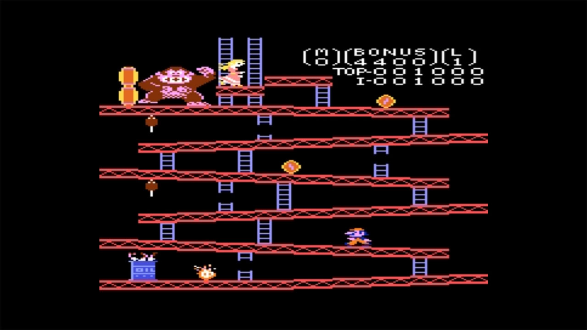

# Atari - 7800 (ProSystem)

### Description

ProSystem is an Atari 7800 emulator.

Place *7800 BIOS (U).rom* (optional) in the emulator's userdata folder.

### License

GPLv2

### Icon

### Fanart

Help make me fanart!

### Screenshots

